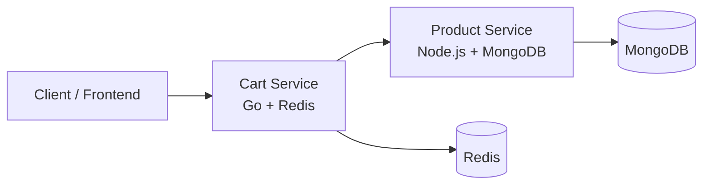

# ecommerce-microservices

## Pricing and Cart Behavior

This project implements a simple pricing model for the shopping cart service.

### Product pricing rules

- Each product in the catalog has a base price stored by the product microservice.
- The cart service validates that the product exists before adding it.
- If the product is invalid or missing, the cart rejects it instead of saving it.
- The cart stores the product metadata needed for the client UI, including:
  - product_id
  - name
  - price
  - category
  - quantity
  - total_price

### Cart total calculation

The cart calculates the line total using the product base price multiplied by the quantity selected by the user.

Formula:

```text
line_total = product.price * quantity
```

Example:

```text
Smart Coffee Maker 3000
Base price: 89.99
Quantity: 52
Total: 89.99 * 52 = 4679.48
```

### Cart item structure

```json
{
  "product_id": "6a7f264093cf99309739a28d",
  "name": "Smart Coffee Maker 3000",
  "price": 89.99,
  "category": "Home & Kitchen",
  "quantity": 52,
  "total_price": 4679.48
}
```

### Cart response format

```json
{
  "user_id": "default",
  "items": [
    {
      "product_id": "6a7f264093cf99309739a28d",
      "name": "Smart Coffee Maker 3000",
      "price": 89.99,
      "category": "Home & Kitchen",
      "quantity": 23,
      "total_price": 2069.77
    }
  ]
}
```

### API endpoints related to pricing

#### GET /api/cart
Returns the current cart, including all stored products, their metadata, quantities, and calculated totals.

#### POST /api/cart/items
Adds a product to the cart.

Request example:

```json
{
  "product_id": "6a7f264093cf99309739a28d",
  "quantity": 2
}
```

The service validates the product ID against the product microservice and then stores the product data with the computed total.

#### PUT /api/cart/items/{productID}
Updates the quantity of a product already in the cart and recalculates the corresponding total.

#### DELETE /api/cart/items/{productID}
Removes a product from the cart.

#### DELETE /api/cart
Clears the complete cart.

### Rules and constraints

- Product IDs must exist in the product catalog.
- Quantity must be greater than zero.
- Invalid product IDs are rejected.
- The cart price is based on the base product price from the product service, not on a user-entered custom price.
- If the same product is added again, the quantity is increased and the total is recalculated.

## System architecture

This project is built as a small event-independent microservices setup using Docker Compose.

### Components

- Product service: Node.js + TypeScript + Express + MongoDB
- Cart service: Go + HTTP server + Redis
- MongoDB: persistence for product and category data
- Redis: persistence for the shopping cart

### Communication pattern

The cart service does not store product details at the source of truth. Instead, it calls the product service over HTTP to validate the product and retrieve the latest metadata.

Sequence:

1. Client sends a request to the cart service.
2. Cart service validates the product ID.
3. Cart service calls the product service at `http://products-api:3000/api/products/{id}`.
4. Product service returns the product with its base price and category information.
5. Cart service stores the product metadata in Redis with quantity and computed total price.

### Communication diagram



### Technology stack

| Layer | Technology |
| --- | --- |
| API Gateway / Client | HTTP requests |
| Cart microservice | Go |
| Product microservice | Node.js + Express + TypeScript |
| Database for products | MongoDB |
| Database for cart | Redis |
| Orchestration | Docker Compose |

### Request flow example

```text
POST /api/cart/items
{
  "product_id": "6a7f264093cf99309739a28d",
  "quantity": 2
}
```

Internal flow:

```text
Client
  -> cart-service POST /api/cart/items
  -> cart-service validates product_id
  -> cart-service calls GET http://products-api:3000/api/products/{id}
  -> product-service reads MongoDB
  -> product-service returns name, price, categoryId
  -> cart-service stores:
       product_id
       name
       price
       category
       quantity
       total_price
  -> cart-service persists in Redis
```

### Why this architecture works

- Product data remains in MongoDB, the source of truth.
- The cart stays lightweight and fast because Redis handles session-like cart state.
- The cart can validate products in real time without duplicating product data in Redis.
- Pricing always comes from the canonical product record.

### Notes

This pricing model is intentionally simple and keeps the cart service decoupled from the product catalog while still preserving the product information needed for checkout and display.
